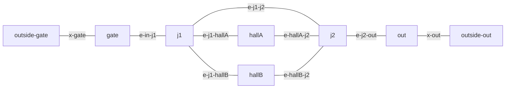

# 提案機構の結合環境

`compose.flow.yml` は、`compose.yml`・`compose.tm.yml`・`compose.ga.yml`・`compose.obs.yml` の上に [tolo-flow-control](https://github.com/pj-hoakari/tolo-flow-control) を加えるオーバーライドになる  
これを重ねると、エッジ端末の計測値が Gateway を通って Observation に届き、Observation が Graph Authoring と Flow Control を呼んで、結果を `optimization_results` に保存するまでを手元で通せる  
通しの確認は [runn](https://github.com/k1LoW/runn) の runbook で行う。runn はホストに入れず、compose の `runn` サービスとしてコンテナで動かす

## 構成

```bash
export COMPOSE_PROJECT_NAME=tolointegration
export COMPOSE_FILE=compose.yml:compose.tm.yml:compose.ga.yml:compose.obs.yml:compose.flow.yml
docker compose up -d --build
```

`compose.flow.yml` が加えるサービスは `flow-control` と `runn` の 2 つになる  
`flow-control` は、tolo-flow-control の既定ブランチ `develop` の固定したコミットを git のビルドコンテキストとしてビルドする  
Flow Control は Gateway を通らない（ADR-0048）。Observation は `compose.obs.yml` の `FLOW_CONTROL_URL`（`http://flow-control:8080`）で直接呼ぶ  
`runn` は profile `runn` に属するので、`docker compose up` では起動しない

| サービス | ホスト | コンテナ内 |
| --- | --- | --- |
| `server`（公開用） | `http://localhost:8080` | `http://server:8080` |
| `fakeidp` | `http://localhost:8082` | `http://fakeidp:8080` |
| `flow-control` | （公開しない） | `http://flow-control:8080` |
| `observation-db` | （公開しない） | `observation-db:5432` |

tolo-web はこの構成に含めない。観測ページは tolo-web 側で起動し、公開用の `http://localhost:8080` へ送る

片付けは、同じ環境変数のまま `docker compose down -v` を実行する

## 通しの確認

```bash
docker compose run --rm runn
```

`runn` サービスは `ghcr.io/k1low/runn` の版を固定したイメージで、`scripts/dev/runbooks` を `/books` に読み込み専用でマウントし、`integration-proposal.yml` を実行する  
Gateway と fakeidp にはサービス名で、Observation の DB には環境変数 `OBSERVATION_DB_DSN` の接続先で届く

runbook は次の 3 つに分かれる

| runbook | 内容 |
| --- | --- |
| `integration-seed.yml` | 事前データを作り、作った ID と観測ページの URL を出力する |
| `integration-cycle.yml` | 1 サイクル分の `Heartbeat` と `ReportMeasurements` を送り、提案を含む行を数える |
| `integration-proposal.yml` | seed を実行し、cycle を 60 秒ずつ空けて繰り返し、提案を含む行が現れたら成功にする |

`integration-seed.yml` は、公開用 listener 越しに次の順で事前データを作る。トークンは fakeidp の `/token` から取る

1. テナントの作成と所有権の取得
2. イベントの作成
3. `SaveGraph` と `PublishRevision`
4. `RegisterEdgeDevice`（ルートごとに観測点を 1 つ、計 7 つ）
5. `MapObservationPoint`（各観測点を `anchor.routeId` で同名のルートに紐づける）

グラフは迂回路のある会場の形で、ノードは `gate`・`j1`・`hallA`・`hallB`・`j2`・`out` の 6 つ、ルートはすべて `EDGE_DIRECTION_BOTH_WAYS` の 7 本になる  
`gate` と `out` は外部ポイント `outside-gate`・`outside-out` と両通行のエッジで結ばれ、入退場の入退出点になる



`integration-proposal.yml` は、seed の後に `events.report` の `event_access` トークンを取り、`integration-cycle.yml` を最大 `maxCycles`（既定 30）回繰り返す  
各サイクルで観測点ごとに送る値は、`integration-cycle.yml` の `vars` の `profile` から runn の式で計算する  
`i` をサイクルの番号とし、`ramp = max(0, i - surgeStart)` とすると、`countIn` は `through + surge × surgeBase × surgeGrowth ^ ramp` を四捨五入した値、`meanDetectedPeople` は `1 + stagnation × ramp` になる

既定の値では、番号が `surgeStart`（10）以下のサイクルでは一定の流量を送る。その後のサイクルでは `e-j1-hallA` への流量が 1.4 倍ずつ増え、検出人数も 2 ずつ増える  
Flow Control の発火には停滞警戒の継続 5 分と急増の両方が要るので、手元では 17 サイクル目で提案が出て、runbook 全体で約 16 分かかった  
急増は直近 30 分の流量の傾きで判定するため、途中でホストがスリープしてサイクルの間隔が空くと、発火までのサイクル数が増える

各サイクルの後、`optimization_results` から、そのイベントの `verdict` が `VERDICT_OPTIMIZED` で、`optimization_result` の `detourPaths` が空でない行を数える  
行が現れた時点で繰り返しを止め、最後のステップでその行の `id`・`verdict`・`solverStatus`・`detourPaths` を出力する  
`maxCycles` 回送っても現れなければ失敗になる。回数は `--var` で変えられる

```bash
docker compose run --rm runn run --verbose --var maxCycles:40 integration-proposal.yml
```

事前データだけを作るときは seed を単独で実行する

```bash
docker compose run --rm runn run --verbose integration-seed.yml
```

出力の `observationPageUrl`（`http://<tenant_id>.localhost:3000/event/<event_id>/observation/<edge_device_id>`）が、その端末の観測ページになる
